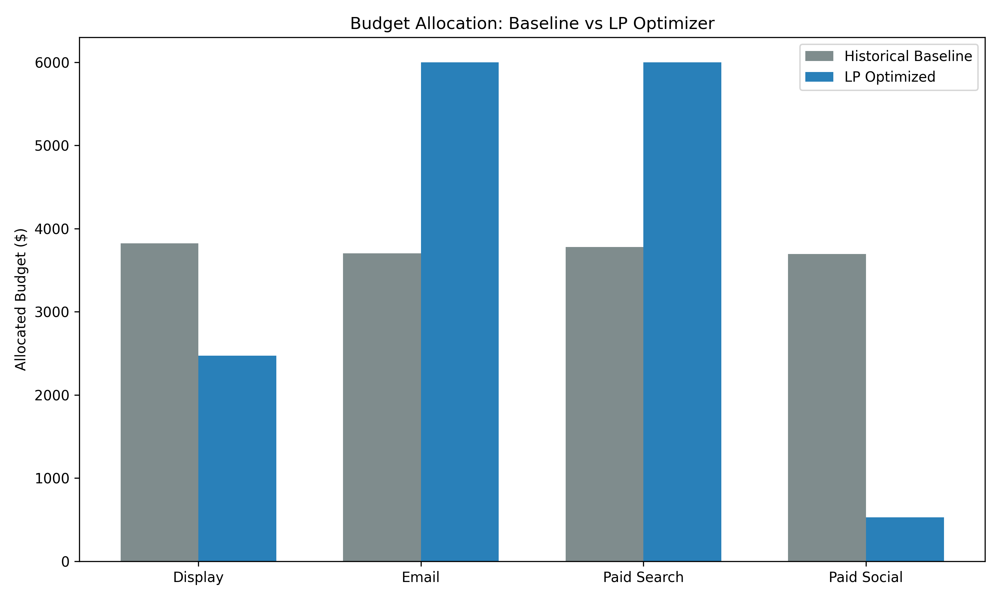
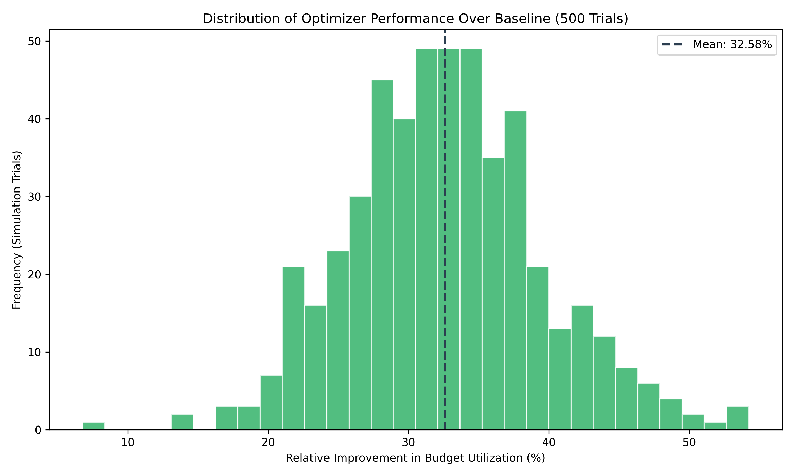

# Resource Constrained Allocation Engine

An end-to-end prescriptive analytics pipeline that optimizes marketing budget distribution across customer segments and channels using constrained linear optimization. 

## Project Overview
Marketing organizations typically allocate operational budgets proportionally based on historical spend, failing to account for the heterogeneous diminishing returns of different channels and behavioral cohorts. 

This engine replaces naive historical spending proportions with a rigorous linear programming (LP) model, identifying the most efficient marginal segments and reallocating budget accordingly. It maximizes total expected conversions subject to total budget limits, channel diversification rules, and cohort-level spend floors.

## Methodology

1. **Synthetic Data Generation (`data_generation.py`):** 
   Generates 90 days of transaction-level records across 4 channels and 5 latent behavioral tiers, embedding unique nonlinear response functions ($Conversions = \alpha \cdot Spend^\beta$) into each channel-cohort intersection.
2. **SQL Pipeline (`sql/segmentation.sql`):** 
   Uses chained Common Table Expressions (CTEs) executing against SQLite to construct rolling Recency, Frequency, and Monetary (RFM) features, segmenting users into behavioral cohorts natively and calculating historical efficiency matrices.
3. **Linear Optimization (`optimizer.py`):** 
   Fits historical data to the underlying power-law curve, discretizes the nonlinear response into piecewise-linear segments, and solves a 60-variable matrix using `scipy.optimize.linprog` (Highs simplex method).
4. **Validation & Simulation (`simulate.py`):** 
   Evaluates the optimizer's performance against a baseline using a Monte Carlo simulation (500 trials), applying Gaussian noise to efficiency parameters to test real-world variance.

## Results
Validated via stochastic Monte Carlo simulation, the LP optimizer natively and consistently outperforms the proportional historical baseline, achieving a **32.58% mean improvement** in budget utilization.





## Tech Stack
* **Python 3.11+**
* **Data Pipeline:** SQLite3, SQL (CTEs, Window Functions), Pandas
* **Optimization:** SciPy (`scipy.optimize.linprog`)
* **Visualization:** Matplotlib, NumPy

## How to Run Locally

1. Install dependencies:
   ```bash
   pip install pandas numpy scipy matplotlib